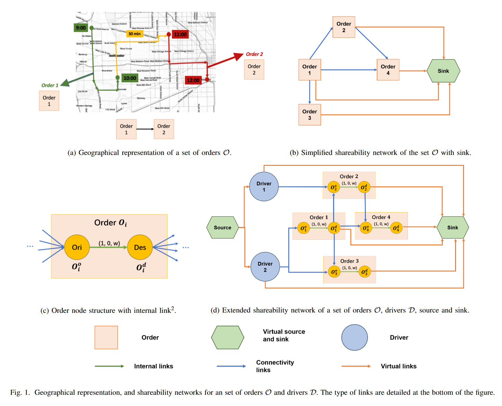
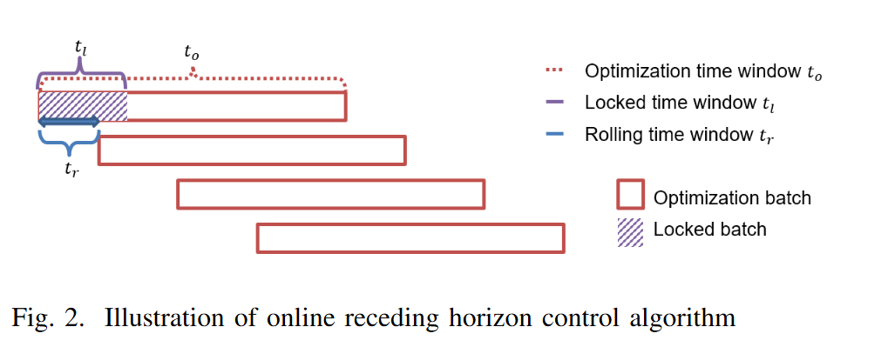
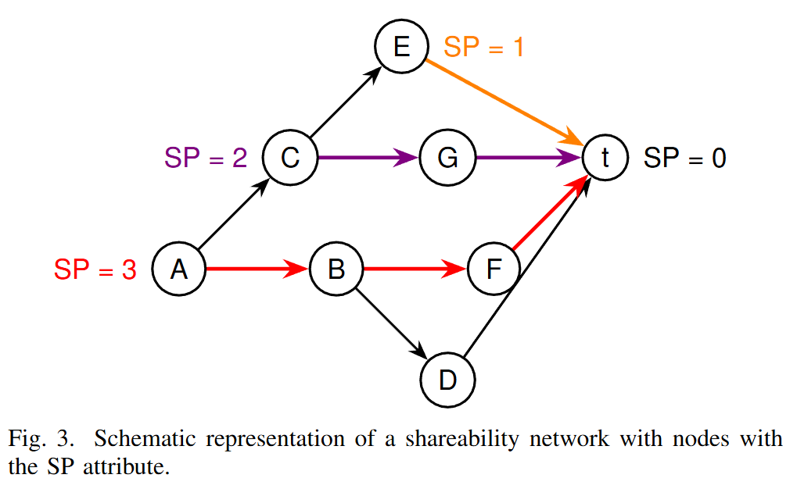
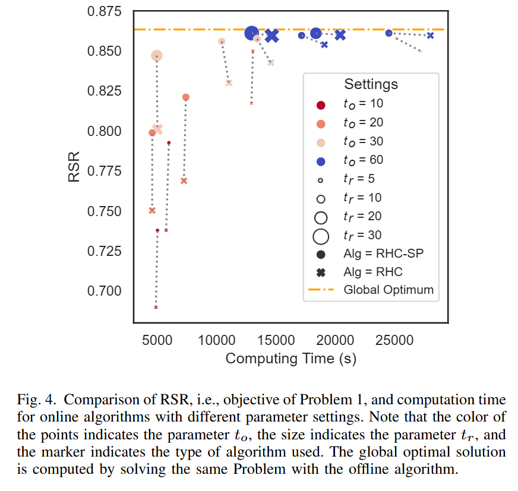
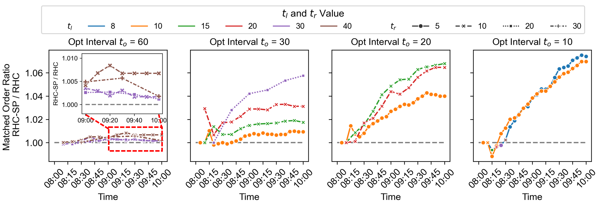

# SP-MoD : Sink Proximity - Online Vehicle Dispatch in Mobility-on-Demand Systems

## What's this?

This repository contains the code and data for the paper:

### Sink Proximity: A Novel Approach for Online Vehicle Dispatch in Ride-hailing

***Authors: Ruiting Wang, Jiaman Wu, Fabio Paparella, Scott J. Moura, Marta C. Gonzalez***

Ride-hailing platforms now shape the pulse of urban mobility, and their performance depends on how intelligently they dispatch vehicles in real time. In this work, we develop a new approach to online vehicle dispatch that strengthens a platform’s ability to serve more requests under uncertainty.

We introduce sink proximity, a network-science-inspired measure that captures how demand and vehicle flows are likely to evolve across the city. By integrating this measure into a shareability-network framework, we design an online dispatch algorithm that naturally anticipates future network states—without depending on fragile spatiotemporal forecasts. The result is a method that directly elevates request service rates while remaining robust to the volatility of real-world demand.

## Contents
1. [Contributions](#contributions)  
2. [Why It Matters](#why-it-matters)  
3. [How It Works](#how-it-works)  
4. [Run the Code](#run-the-code)
5. [Datasets](#datasets)  
6. [License](#license)

## Contributions

- **Novel Measure**:
We introduce ***sink proximity*** in the context of network flow problems, which quantifies the longest path distance from any given node to the sink node in a network flow. Within shareability networks, this measure helps to account for downstream opportunities and incorporates elements of future information regarding the network's expansion.

- **Efficient Computation in a DAG**: 
We demonstrate how ***sink proximity*** can be efficiently approached as a single source longest path problem in a directed acyclic graph (DAG), which can be solved in polynomial time. This ensures that real-time ride-hailing systems can feasibly integrate the measure into online algorithms.

- **Application to Vehicle Dispatch**: 
We incorporate sink proximity into a network-flow-based receding horizon framework (RCH-SP). Simulation results show how this approach boosts the request service rate relative to standard RHC solutions. This algorithm represents a significant advancement in optimizing the dispatch process through the application of network science principles.

## Why It Matters

Shared mobility services have greatly transformed urban transportation and provided a convenient alternative to reduce the use of private vehicles. The global market size of ride-hailing was 106.66 billion in 2023 and is projected to grow from \$123.08 billion in 2024 to \$480.09 billion by 2032. 
It is fundamental for these shared mobility services to become both efficient and profitable. 

Platform-based operators without vehicle ownership primarily rely on **increasing the volume of successfully matched driver–rider pairs** to boost revenues.

In this paper, we introduce new algorithms that weave together network science and shareability networks to boost the online matching rate between drivers and riders. Strengthening this core mechanism makes the entire system run more effective and more efficient, unlocking real economic gains and trimming its environmental footprint.

## How It Works
Disclaimer: This is a simplified overview of our approach. For full proofs, technical details, and discussion of edge cases, please refer to the paper.

- Step 1: We cast **Vehicle Dispatch Problem** as a well-established **Maximum Cost Flow Problem**. This allows us to use polynomial-time machinery developed for minimum/maximum-cost flow problems to solve the dispatching problem efficiently.

- Step 2: We introduce the online version of the problem and show that it can be tackled using a receding-horizon control (RHC) strategy. Naturally, the limited look-ahead window constrains decision quality, making the resulting solution **inherently suboptimal**.

  

- Step 3: We introduce ***Sink Proximity*** measure to capture the network evolving dynamics, such that we can address the suboptimality in the online RHC algorithm. 
    - In a shareability network, the sink proximity of an order is **defined as** the maximum number of orders that a driver can be matched with after serving this order. 
    - Finding the maximum number of orders a driver can take in a shareability network can be expressed as a single-source DAG longest path problem (which can be **effiently computed**).

  

- Step 4: Finally, we demonstrate the proposed algorithm (RHC-SP) is efficient and effective, compared to the RHC algorithm. Only the key information is shown, for full analysis please refer to the paper. 

    - For the same parameter setting, RHC-SP (circle) constantly has higher Request Service Rate (RSR) comparing to RHC (cross).
    

      
    

    - For the same parameter setting, RHC-SP almost always has higher rolling RSR comparing to RHC (ratio >1).

## Run the Code

This repository is organized to take you from raw NYC TLC trip data all the way to trained models, experimental results, and visualizations. Below is a roadmap for running the full pipeline.

**1. Prepare the Data**
    
Start by downloading the raw datasets:

- NYC Taxi Trip Records: https://www.nyc.gov/site/tlc/about/tlc-trip-record-data.page

- NYC Taxi Zone Shapefiles (for area IDs): https://www.kaggle.com/datasets/mxruedag/tlc-nyc-taxi-zones

Place the downloaded files in the appropriate folder:

- `Database/NYC_trip/` for the raw NYC trip record data
- `Database/NYC_area/` for the NYC taxi zone shapefiles

Make sure these directories are populated before running any preprocessing scripts.

Then run the scripts in:
`data_preprocess/`

These scripts:

- extract time and area IDs for each trip

- filter out trips that are unreasonably short or long

- generate driver information

- save the cleaned datasets as CSV files for downstream use

Once this step is done, your processed data will appear in the Database/ directory.

**2. Generate SP Values**

Inside the `SP/` directory, 
1) run `SP/run_SP.py` that  construct shareability networks and compute SP value. 
2) run `SP/SP_predict_fig_6.ipynb` trains the Support Vector Machine model to predict the SP values for June 2nd. 

These predictions are later used by the RHC-SP algorithm (Appendix B)

This step outputs the SP predictions into the `Database/prediction` folder.

**3. Run Experiments**

The `experiments/` directory contains all algorithmic evaluations, baselines, and ablation studies.
Here, you can run Algorithm 1-3 in the manuscript, respectively:

- Offline

- RHC-SP

- RHC 

Due to space limitations, only part of the experimental results used in the paper’s visualizations are included.

**4. Visualize the Results**

Plots and figures are generated using the scripts in:
`visualize/`. 

These notebooks read the processed data and experiment logs from Database/ and produce Figure 4 and 5.

## Datasets

For the orders we use the [NYC Taxi and Limousine Commission (TLC)](https://www.nyc.gov/site/tlc/about/tlc-trip-record-data.page) trip record data. The dataset contains the start time, start location (as an area code), end time, and end location (as an area code) of each taxi order. The city is divided into 260 non-overlapping areas during data processing. Thereafter, the peak hours of two mornings (8:00 to 10:00 am) on June 1 and 2, 2022, are selected. There are 11,483 and 11,825 requests in these two days, respectively.

## License

[![CC BY-NC-ND 4.0][cc-by-nc-nd-shield]][cc-by-nc-nd]

This work is licensed under a [Creative Commons Attribution-NonCommercial-NoDerivs 4.0 International License][cc-by-nc-nd].

[cc-by-nc-nd-shield]: https://img.shields.io/badge/License-CC%20BY--NC--ND%204.0-lightgrey.svg
[cc-by-nc-nd]: https://creativecommons.org/licenses/by-nc-nd/4.0/
